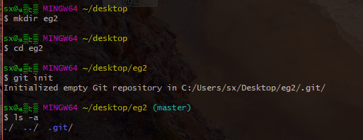
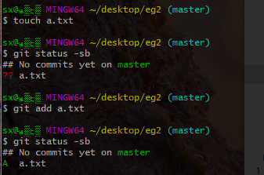
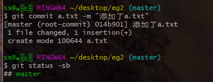

1、
git init
这是仓库初始化命令，进入一个安全目录，在目录下运行git init后会创建一个.git目录，使用ls -a命令可以看到它，它就是一个仓库。

2、
git add
将文件添加到暂存区，例如：新建一个a.txt文件，用git status -sb查看文件状态，可以看到文件前有??，这表示git不知到如何处理文件变动，这时运行git add a.txt，再用git status -sb查看就会发现文件前符号变成了A，意思就是添加。

3、
git commit -m "提交信息"
将add过的变动提交至仓库，提交信息就是你想要的注释等，方便以后查阅。
可以选择一次提交一个文件：git commit filename -m "xxx"
或者一次全部提交：git commit . -m "xxxx"
